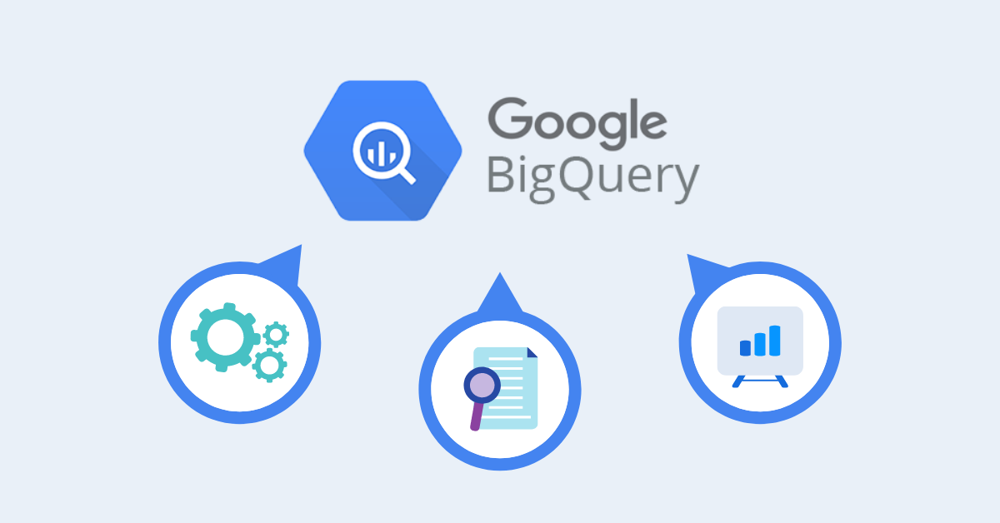

# 📈 Sales & Customer Analytics Project



Welcome to the project site for my Google BigQuery-based customer and sales analytics pipeline. Built from scratch using SQL, BigQuery, and Kaggle datasets.

---

## 🔄 ETL Overview

- Uploaded `sales.csv` and `customer.csv` to Google BigQuery
- Created denormalized tables using SQL joins
- Aggregated category, region, and gender-based insights

---

## 🧪 Sample Queries

```sql
SELECT category, SUM(quantity) 
FROM customer_sales_data 
GROUP BY category 
ORDER BY 2 DESC LIMIT 5;
